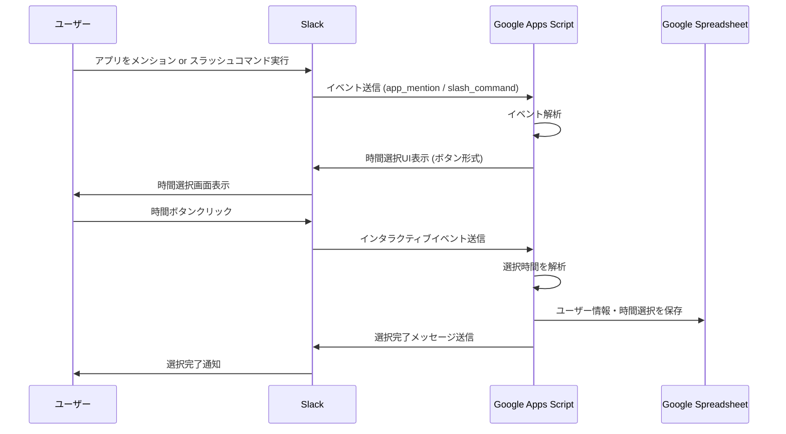
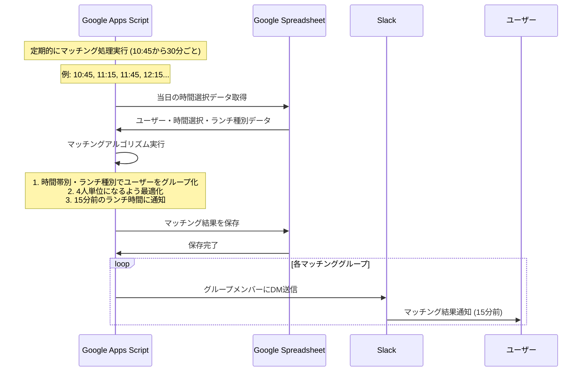
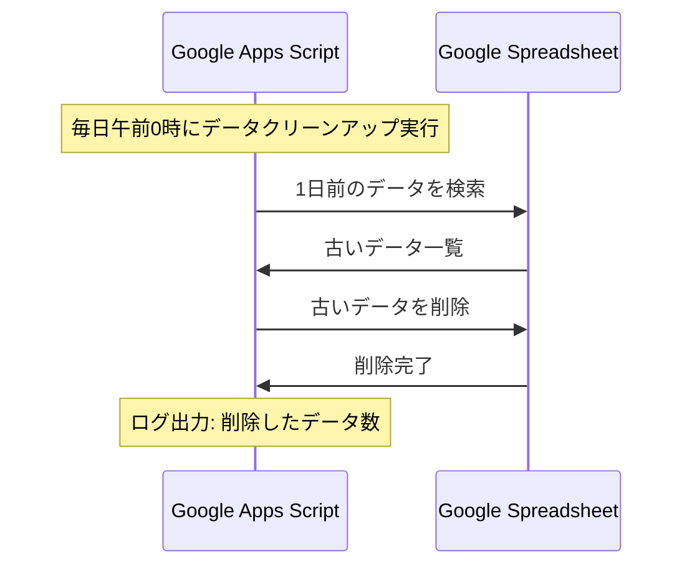
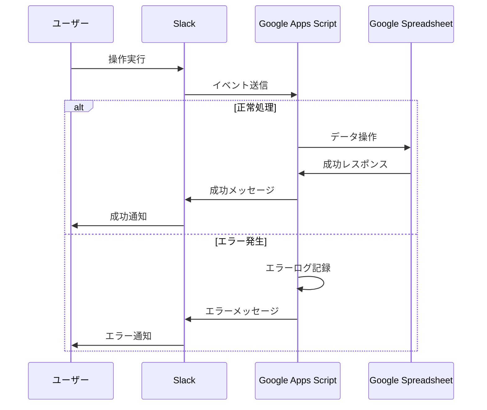

# Lunch Launcher - シーケンス図

## 1. ユーザーがランチ時間を選択する流れ



## 2. マッチング処理の流れ（更新版）



## 3. データ管理の流れ



## 4. エラーハンドリングの流れ



## 5. スプレッドシート構造（更新版）

### users シート
| user_id | username | created_at |
|---------|----------|------------|
| U123456 | john_doe | 2024-01-15 10:30:00 |

### preferences シート
| user_id | time_slots | lunch_preferences | created_at |
|---------|------------|-------------------|------------|
| U123456 | ["12:00", "12:30"] | ["和食", "イタリアン"] | 2024-01-15 10:30:00 |

### matches シート
| match_id | user_ids | time_slot | lunch_type | created_at |
|----------|----------|-----------|------------|------------|
| M001 | ["U123456", "U789012"] | "12:00" | "和食" | 2024-01-15 11:45:00 |

## 6. マッチングアルゴリズム詳細（更新版）

### 実行タイミング
- **頻度**: 10:45から30分ごと実行
- **実行時刻**: 10:45, 11:15, 11:45, 12:15, 12:45, 13:15, 13:45, 14:15, 14:45
- **通知タイミング**: 各ランチ時間の15分前

### 絶対条件
1. **時間**: 同じランチ開始時刻
2. **ランチ種別**: 同じランチ傾向（和食、イタリアン、中華など）

### マッチング優先順位
1. **人数最適化**: 4人単位になるよう最適化
2. **時間帯**: 早い時間帯を優先
3. **登録順**: 先に登録したユーザーを優先

### 処理ステップ
1. **データ取得**: 当日の時間選択・ランチ種別データを取得
2. **グループ化**: 時間・ランチ種別でユーザーをグループ化
3. **人数最適化**: 各グループを4人単位に最適化
   - 4人未満の場合は他の時間帯と統合を検討
   - 4人超過の場合はランダム分割
4. **結果生成**: マッチング結果をスプレッドシートに保存
5. **通知送信**: 各グループメンバーにDM送信（15分前）

### 実行例
```
10:45実行 → 11:00ランチの15分前通知
11:15実行 → 11:30ランチの15分前通知
11:45実行 → 12:00ランチの15分前通知
12:15実行 → 12:30ランチの15分前通知
...
```

### 例: 11:00ランチのマッチング
```
時間: 11:00
ランチ種別: 和食
ユーザー: 6人 (A, B, C, D, E, F)

結果:
- グループ1: A, B, C, D (4人)
- グループ2: E, F (2人) → 他の時間帯と統合を検討
```

### 例: 12:00ランチのマッチング
```
時間: 12:00
ランチ種別: イタリアン
ユーザー: 3人 (G, H, I)

結果:
- グループ1: G, H, I (3人) → 他の時間帯と統合を検討
```
